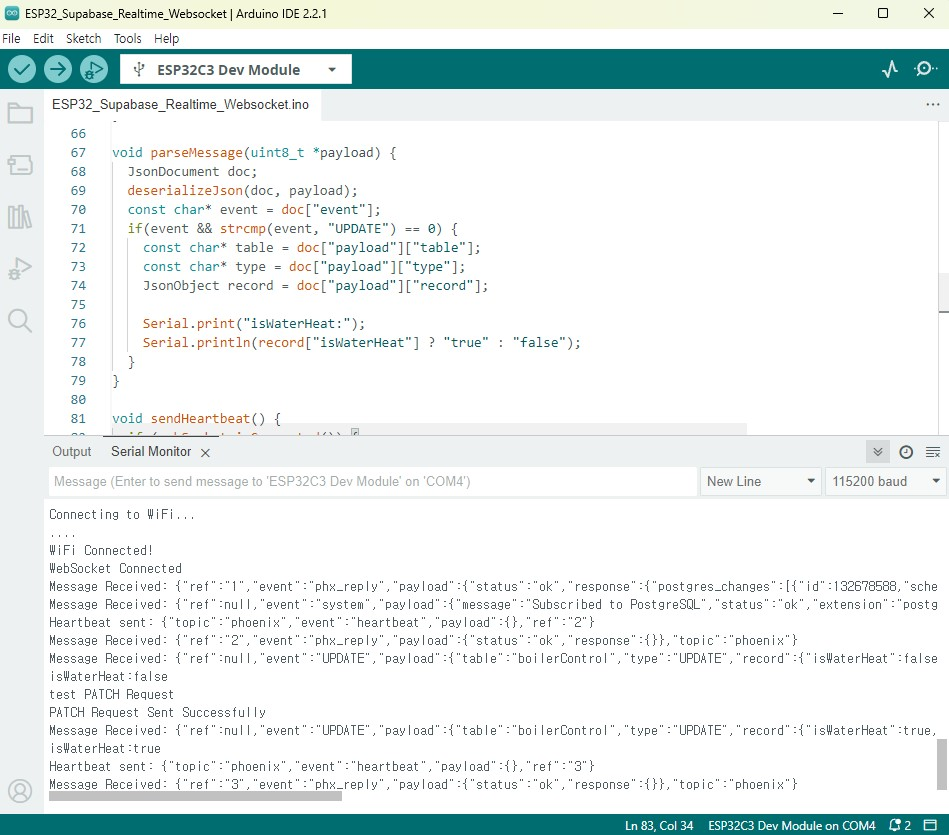
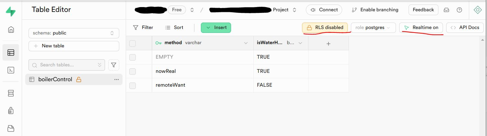

# ESP32 Supabase RealTime WebSocket Example

This project demonstrates how to use an ESP32 (tested with ESP32-C3 Super-Mini) to connect with Supabase RealTime via WebSocket. It is based on foundational code developed for a previous project due to compatibility issues with existing Supabase libraries. **Please note that this is not a library but a basic example for educational and testing purposes.**

---

## 🔗 Recommended Hardware
This project was tested with the **ESP32-C3 Super-Mini**. You can purchase it from [AliExpress](https://s.click.aliexpress.com/e/_oEYaVpB) or other online retailers.

> Note: The provided link is for reference only. Please verify the specifications before purchasing.

---

## ⚠️ Important Notes
- **This is not a polished library** but a working example for integrating Supabase RealTime with ESP32. 
- The code was tested on **ESP32-C3 Super-Mini** and may require adjustments for other devices.
- Ensure that you configure the following placeholders in the code before running:
  - ssid: Your Wi-Fi network name.
  - password: Your Wi-Fi password.
  - host: Your Supabase project's host URL.
  - API_KEY: Your Supabase API key.
  - tableName: The name of the table you want to listen to.
  - record["isWaterHeat"], payload: The specific column you want to monitor for changes.
- **Error handling in this code is minimal** and may not cover all edge cases. You might need to implement additional error handling mechanisms for production use.
  
- **Supabase Table Settings**:
  - Make sure that **Row Level Security (RLS)** is **disabled** in the Supabase Table Editor for the table you are using.
  - Enable **Realtime** for the table by turning on the Realtime feature in the Table Editor.

---

## 🛠️ Setup Instructions
Update the following placeholders in the code:
   ```cpp
    // Wi-Fi credentials
    const char* ssid = "<WIFI_SSID>";
    const char* password = "<WIFI_PASS>";
    
    // Supabase WebSocket URL and API Key
    const char* host = "<YOUR_PROJECT.supabase.co>";
    const char* API_KEY = "<SUPABASE_API_KEY>";
    
    const char* tableName = "<YOUR_TABLE_NAME>";

    // column name
    Serial.println(record["isWaterHeat"] ? "true" : "false");
    String payload = "{\"isWaterHeat\": true}";
   ```

---

## 🧪 Testing
1. Ensure your Supabase RealTime is properly configured to send updates for the specified table and column.
2. Monitor the serial output from the ESP32 to verify successful connection and data updates.

---

## 🚨 Known Limitations
- **Error Handling**:  
  This code includes basic error handling for common scenarios (e.g., failed Wi-Fi connection or WebSocket disconnection). However, it may not adequately handle all edge cases, such as:
  - Network interruptions or reconnection logic.
  - Invalid API keys or Supabase configurations.
  - Parsing errors for unexpected payload structures.

  You are encouraged to review and enhance the error-handling logic based on your specific requirements.

---

## 🖼️ Example Photos

### 1. ESP32-C3 Super-Mini
Here is the ESP32-C3 Super-Mini used in this project:


---

### 2. Serial Output Example
This is an example of the serial output you can expect:



---

### 3. Supabase table editor
check RLS disabled and realtime on



---


---

## 📋 Disclaimer
This example is provided "as is" without warranty of any kind. Use it as a starting point for your own implementations. Additional testing and modifications may be required for production use.

---
